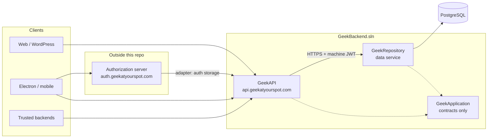

# GeekBackend Architecture

GeekBackend is the **platform data and auth-storage layer** for all Geek products. It is **not** an authorization server. Tokens for users and apps are issued by a separate **.NET authorization server** (`auth.geekatyourspot.com`). This repo ships two HTTP services and one shared contracts library.

---

## Platform topology



| Role (OAuth vocabulary) | Deployment | Responsibility |
|-------------------------|------------|----------------|
| **Authorization server** | `auth.geekatyourspot.com` (separate .NET service) | Issue tokens, OIDC discovery, login UI, client registry |
| **Resource server (platform API)** | GeekAPI | Validate user tokens (future), expose `/api/*`, SignalR sync, proxy auth-storage calls |
| **Resource server (data)** | GeekRepository | All PostgreSQL reads/writes; no product-facing HTTP except from GeekAPI |
| **Client** | Each Geek product | OIDC against auth; **never** call GeekRepository directly |

**Hard rules**

1. **Only GeekAPI talks to GeekRepository** — no product service (OrderStack, RankPilot, etc.) holds `REPO_URL` or database credentials for platform auth/content.
2. **No authorization server in GeekBackend** — no `/connect/*`, no OpenIddict issuer on GeekAPI.
3. **Geek SEO and other product APIs live in their own repos** — not in GeekBackend.

---

## Solution layout

```
GEEKBACKEND.slnx
├── GeekApplication     Class library — entities, interfaces, Result<T>, auth helpers (no HTTP, no DB)
├── GeekAPI             Web app — platform gateway (Railway: api.geekatyourspot.com)
└── GeekRepository      Web app — universal data service (Railway: GeekRepository project)
```

### Project references (compile-time)

```
GeekAPI        → GeekApplication only
GeekRepository → GeekApplication only
GeekApplication → (no project references)
```

GeekAPI **must not** reference GeekRepository. All data access is **HTTP** from GeekAPI HttpClients to GeekRepository controllers.

---

## GeekAPI (today)

**Purpose:** Platform API gateway and **auth-storage façade** for the external authorization server.

| Surface | Auth | Notes |
|---------|------|--------|
| `/api/case-studies`, `/api/departments`, `/api/use-cases` | Public read | Marketing/content |
| `/api/auth/*` | `X-API-Key` (`GEEK_BACKEND_API_KEY`) | User/device/2FA/OIDC-storage; optional `X-Geek-User-Id` for user-scoped routes |
| `/hubs/sync` | Open (connection hardening TBD) | Session sync hub |

**Outbound:** `HttpClient` named `GeekRepository` → `REPO_URL`, authenticated for service-to-service calls (see below).

**Does not:** Host login pages, token endpoints, or product-specific domains (e.g. SEO).

---

## GeekRepository (today)

**Purpose:** Single data plane for platform auth tables and shared content tables.

| Access style | Tables | Tooling |
|--------------|--------|---------|
| Dapper | `users`, `devices_oauth`, `rbac_*`, `audit_log`, sync tables, … | Atomic SQL, race-safe auth writes |
| EF Core | `departments`, `case_studies`, `use_cases`, … | Migrations via `AppDbContext` |

Every controller is protected by the **InternalService** policy: authenticated caller must present the `internal.api` scope (see service-to-service auth).

---

## Service-to-service auth: today vs target

Shared static secrets (`REPO_API_KEY` / `X-Repo-Key`) are **not** the long-term design. They create a single long-lived bearer that, if leaked, grants full data-plane access with no audience binding, no rotation story, and no audit trail per call. Production incidents tied to bootstrap secrets are why this path is treated as **technical debt**.

### Target (zero-trust S2S)

| Property | Value |
|----------|--------|
| Grant | `client_credentials` |
| Client | `geekapi` (confidential), registered on **authorization server** |
| Token | Short-lived JWT |
| `aud` | `geek-repository` |
| Scope | `internal.api` |
| Transport | TLS only |
| Validation | GeekRepository validates JWT against auth issuer JWKS (`AUTH_SERVER_URL` → auth, not api) |

GeekAPI obtains a machine token from auth, attaches `Authorization: Bearer`, and GeekRepository validates issuer, audience, signature, expiry, and scope. **No shared repo API key in production.**

### Interim (local / integration tests only)

`REPO_API_KEY` exists in code today for bootstrap and tests. Treat it as:

- **Allowed:** local dev, CI with isolated databases, emergency break-glass with immediate rotation plan
- **Forbidden:** production reliance, documentation as “the” security model, or duplication across many Railway services

**Migration checklist**

1. Deploy authorization server with `geekapi` client + `internal.api` scope.
2. GeekRepository: JWT validation (issuer = auth), drop `RepoApiKeyAuthenticationHandler` from production config.
3. GeekAPI: client-credentials token provider + delegating handler on `GeekRepository` HttpClient; remove `REPO_API_KEY` from Railway.
4. Remove `REPO_API_KEY` from `.env.example` and integration defaults once JWT path is green in CI.

---

## External authorization server (future in platform)

Lives **outside** this repository (`.NET`, not Node). Responsibilities:

- OIDC/OAuth 2.1 for all Geek apps (desktop PKCE, confidential web, machine clients)
- User login, consent, token issuance, JWKS
- **Adapter** to GeekAPI for persistence: users, passwords, TOTP secrets, devices, OIDC storage rows — via `GEEK_BACKEND_API_KEY`, not direct database access

GeekAPI remains the **only** path to GeekRepository for those tables.

---

## Data boundaries

### Auth storage (GeekAPI + GeekRepository)

- Registration, credentials, TOTP, devices (`devices_oauth`), audit, sync queue
- Consumed by authorization server adapter and internal platform tools — not by arbitrary product backends without `GEEK_BACKEND_API_KEY`

### Content (GeekAPI + GeekRepository)

- Departments, case studies, use cases — public read via GeekAPI; writes via authenticated platform routes as products require

### Out of scope for GeekBackend

- Geek SEO schema, crawlers, WordPress publish, SERP APIs — **`Geek-SEO` repo** and GeekSeoBackend
- Per-product business tables (restaurant, CRM, etc.) — respective product backends via GeekAPI BFF pattern when platform auth is needed

---

## Multi-device and device trust

- **Fingerprint:** `SHA-256(machineId || biosUuid_or_empty || platform)` per user+device (immutable)
- **Policy:** `allow_multiple_devices`, `max_devices` (default 5); single-device mode revokes siblings
- **Challenge-response:** ECDSA on `devices_oauth` via GeekRepository; exposed through GeekAPI `/api/auth/devices/*`

---

## TOTP 2FA

- Setup/verify/recovery via `/api/auth/2fa/*` (GeekAPI → repository)
- RFC 6238; recovery codes stored hashed (BCrypt)
- External authorization server invokes these routes during login; issuer name for QR may use a configurable display host (not necessarily api hostname)

---

## Real-time sync (SignalR)

- Hub: `/hubs/sync` on GeekAPI
- Scope: identity/session state (profile, device presence) — **not** general app event bus
- Conflict model: last-write-wins on `updated_at`
- **Future:** hub connections authenticated with user access tokens from auth (not API keys)

---

## Deployment (Railway)

| Service | Project | Public host |
|---------|---------|-------------|
| GeekAPI | GeekAPI | `api.geekatyourspot.com` |
| GeekRepository | GeekRepository | `geekrepository-production.up.railway.app` (or custom domain) |

### Environment variables

**GeekAPI**

| Variable | Purpose |
|----------|---------|
| `REPO_URL` | GeekRepository base URL |
| `GEEK_BACKEND_API_KEY` | Inbound trust for auth-storage and admin adapters |
| `CORS_ORIGINS` | Browser origins allowed to call API |
| `PORT` | Listen port |

**GeekRepository**

| Variable | Purpose |
|----------|---------|
| `DATABASE_URL` | PostgreSQL (Supabase/Railway) |

**Target additions (replace repo API key)**

| Variable | Service | Purpose |
|----------|---------|---------|
| `AUTH_SERVER_URL` | GeekRepository (and GeekAPI token client) | Issuer URL for JWT validation / token acquisition (`https://auth.geekatyourspot.com`) |
| `GEEKAPI_CLIENT_ID` / secret | GeekAPI | Machine client for `client_credentials` (names illustrative; use platform secret store) |

**Remove from Railway when JWT S2S is live**

- `REPO_API_KEY`, `OPENIDDICT_*`, `GEEK_*_CLIENT_SECRET` (issuer-era), `AUTH_SERVER_URL` pointing at **api** as issuer, `GEEK_SEO_*`

---

## Security principles

1. **Short-lived, audience-bound tokens** for machine access — not shared passwords in headers.
2. **Least privilege** — `internal.api` only on repo; product scopes only on user tokens from auth.
3. **Single data path** — GeekAPI → GeekRepository; products do not hold DB URLs for platform data.
4. **Secrets in platform vault** — Railway variables or external secret manager; never commit; rotate on leak.
5. **`GEEK_BACKEND_API_KEY`** is for **trusted backends calling GeekAPI** (e.g. auth adapter). It is separate from repo S2S and must not be confused with user sessions.

---

## Database cleanup (OAuth / OpenIddict era)

On startup, `SqlMigrationRunner` applies `Migrations/Sql/0004_drop_oauth_openiddict_and_adapter_storage.sql`, which drops issuer tables, adapter storage, and `geek_seo` schema. **Greenfield:** the external authorization server owns client/token persistence; this database holds users, devices, and platform content only.

---

## Testing

```bash
dotnet build GEEKBACKEND.slnx
dotnet test GEEKBACKEND.slnx
```

Integration tests may use `REPO_API_KEY` until the JWT client-credentials path is wired in test fixtures. Prefer issuing test JWTs from a test issuer over static repo keys when adding new tests.

---

## Related docs

- [README.md](./README.md) — build, run, status table
- [GeekAPI/CLAUDE.md](./GeekAPI/CLAUDE.md) — GeekAPI routes and env (update when JWT S2S lands)
