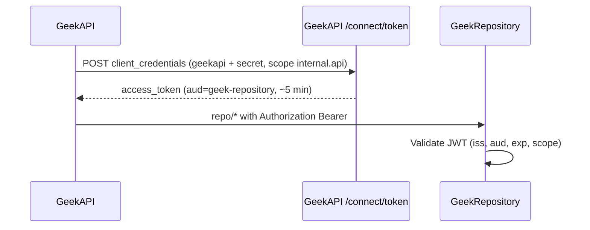

# GeekRepository OAuth access (GeekAPI only)

GeekRepository is an internal data plane. Only **GeekAPI** may call it, using **OAuth 2.1 client credentials** as defined in `GeekRepository/plan/COMPREHENSIVE_IMPLEMENTATION_PLAN.md` (Zero Trust / Client Credentials).

## Flow



| Item | Value |
|------|--------|
| Client ID | `geekapi` |
| Scope | `internal.api` |
| Audience / resource | `geek-repository` |
| Token endpoint | `{AUTH_SERVER_URL}/connect/token` |
| Service token TTL | 5 minutes |

## Environment variables

| Service | Variable | Purpose |
|---------|----------|---------|
| GeekAPI | `AUTH_SERVER_URL` | Issuer URL (same deployment) |
| GeekAPI | `GEEK_API_CLIENT_SECRET` | `geekapi` client secret |
| GeekAPI | `REPO_URL` | GeekRepository base URL (public URL is fine) |
| GeekRepository | `AUTH_SERVER_URL` | Must match GeekAPI issuer for JWT validation |

`REPO_API_KEY` / `X-Repo-Key` are **deprecated** — supported only in **Development** for local bootstrap and integration tests. Do not set `REPO_API_KEY` in production.

## Railway (separate projects)

GeekAPI and GeekRepository may stay in different Railway projects. Use the repository **public** URL in `REPO_URL`; security is **OAuth**, not private networking.

1. Set `GEEK_API_CLIENT_SECRET` on **both** GeekAPI and GeekRepository (GeekRepository needs it only if you run bootstrap tooling; issuer validation uses `AUTH_SERVER_URL`).
2. Set `AUTH_SERVER_URL` on **both** to the GeekAPI public issuer URL (e.g. `https://geekbackend-production-41f7.up.railway.app`).
3. Deploy GeekAPI first so `geekapi` client and `internal.api` scope are seeded.
4. Remove `REPO_API_KEY` from both services after verifying `/health` reports `database: ok`.

## Verify

```bash
# Without token — must fail
curl -sS -o /dev/null -w "%{http_code}\n" \
  "$REPO_URL/repo/openiddict/applications/count"

# GeekAPI health (uses Bearer via geekapi client)
curl -sS "$AUTH_SERVER_URL/health"
```
